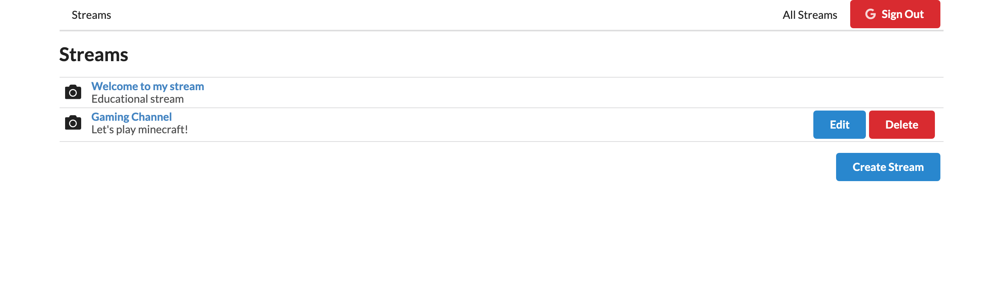

# Twitch

A streaming hub that a user can display a title and description for users to click on and view their stream.

## Features

- Sign in/out through Google Cloud Platform for each user.
- View a list of clickable streams that have titles and description of the stream.
- Edit your own stream.
- Delete your own stream.
- Watch a users stream.

## Final Product





## Getting Started

1. Fork this repository, then clone it.
2. Install the dependencies using the `npm install` command.
3. Start the server using `npm start`.
4. Start the rtmpserver using `npm start`.
5. Start OBS, go to settings, stream,
   service = Custom,
   server = rtmp://localhost/live,
   Stream Key = 1 (this will show the stream in the first stream link you have provided in the browser.
6. Start the client using `npm start`. The app will be served at <http://localhost:3000/>.
7. Go to <http://localhost:3000/> in your browser.

## Run the server folder

Go into server folder

```sh
npm install -g json--server
npm start
```

## Run the client folder

Go into client folder

```sh
npm start
```

## Run the rtmp folder

Go into rtmp folder

```sh
npm start
```

## Dependencies

- axios
- flv.js
- lodash
- react
- react-dom
- react-redux
- react-router-dom
- react-scripts
- redux
- redux-form
- redux-thunk
